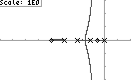

Root Locus v0.3
===============

This program allows you to see the root locus of any given transfer function and
to add a regulator. You can quickly modify the value of ‘k’ and see if the
system with that gain would be stable or unstable. You can also see the
positions of the poles for that gain.

It has been created using HP-GCC 2.0, so it can only run on an hp 50g (and maybe
hp 49g+). It isn’t needed to install ARM ToolBox in your calculator, though, the
program comes in a way it will run without using it.

It has been hosted since 2012 here: https://www.hpcalc.org/details/7354

My website: www.skylyrac.net

**IMPORTANT NOTE**: This program was created with HP-GCC. That means that if it
crashes there is no way to return to the HP menu by software means. In case that
happens, just press the reset button (or remove a battery and put it back again
after a second).  This program has been tested a lot, it shouldn’t crash, but
better safe than sorry. You may even lose the contents of the non-flash memory
(ports HOME, 0 and 1). You should do backups of your files just in case.

License
-------

Root Locus 0.3, Copyright (C) 2011-2012 Antonio Niño Díaz

This program is free software: you can redistribute it and/or modify
it under the terms of the GNU General Public License as published by
the Free Software Foundation, either version 3 of the License, or
(at your option) any later version.

This program is distributed in the hope that it will be useful,
but WITHOUT ANY WARRANTY; without even the implied warranty of
MERCHANTABILITY or FITNESS FOR A PARTICULAR PURPOSE.  See the
GNU General Public License for more details.

You should have received a copy of the GNU General Public License
along with this program.  If not, see <http://www.gnu.org/licenses/>.
